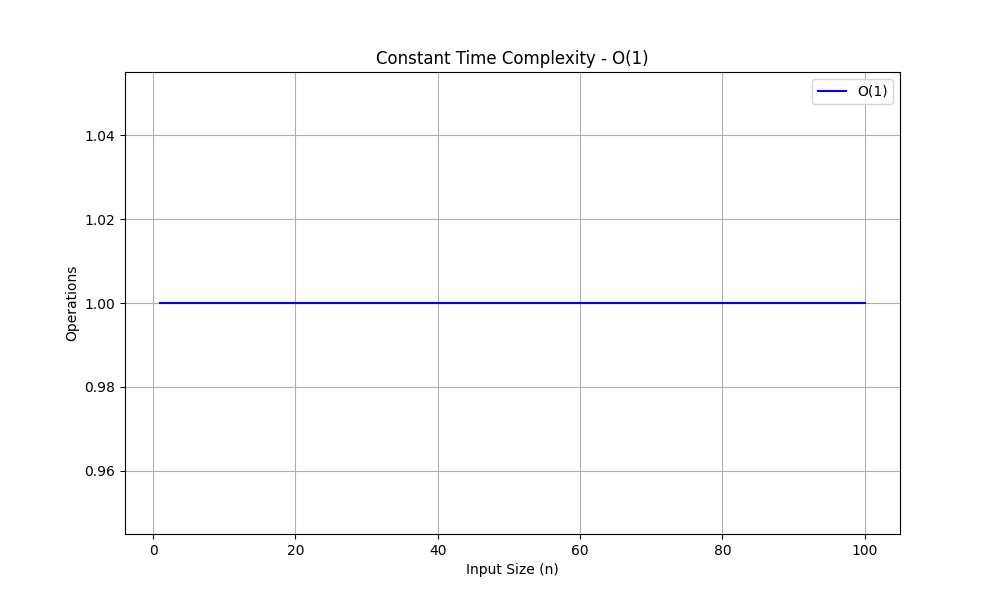
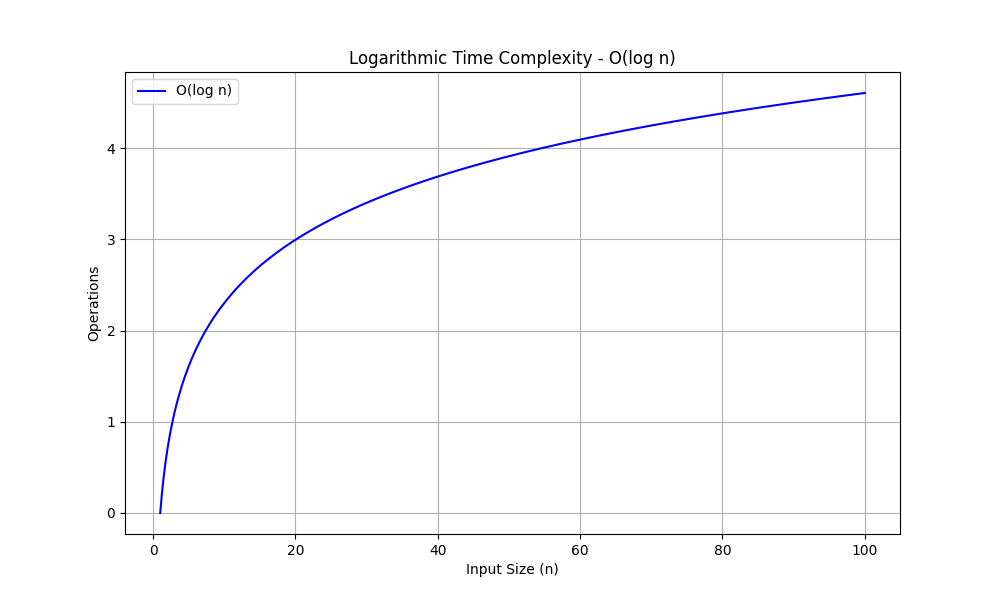
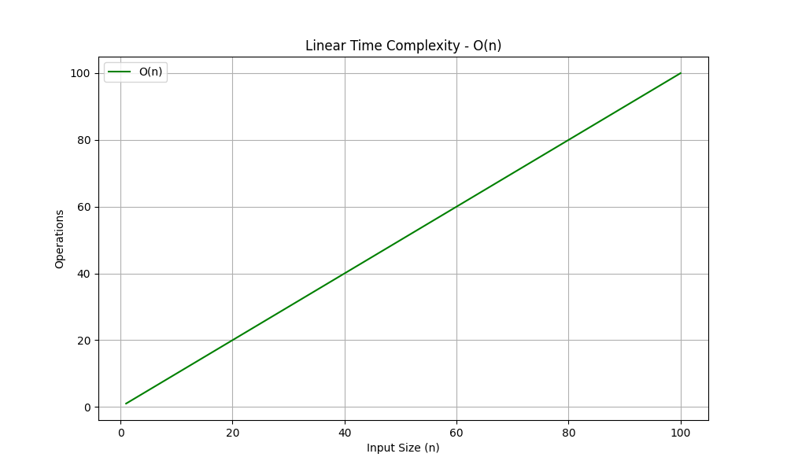
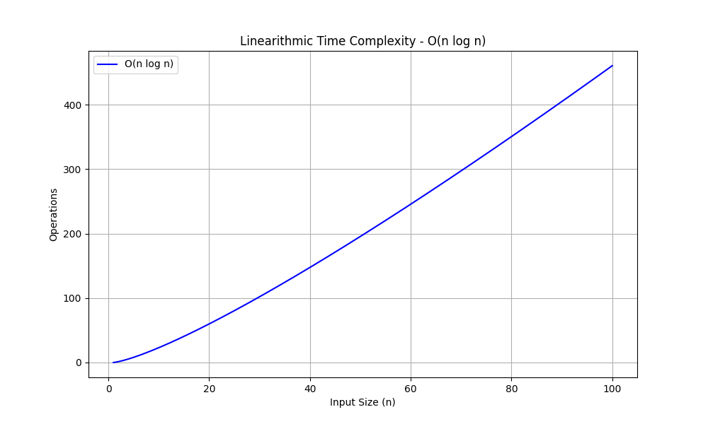
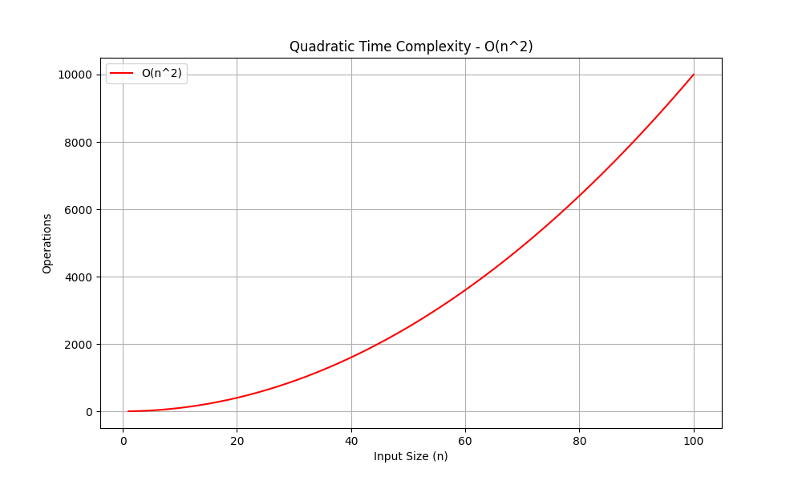
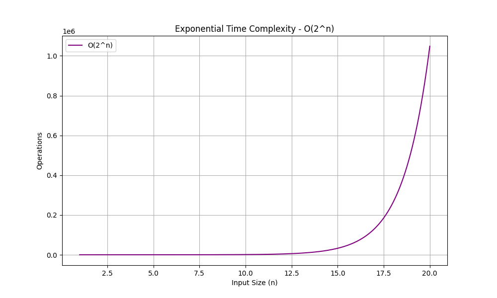
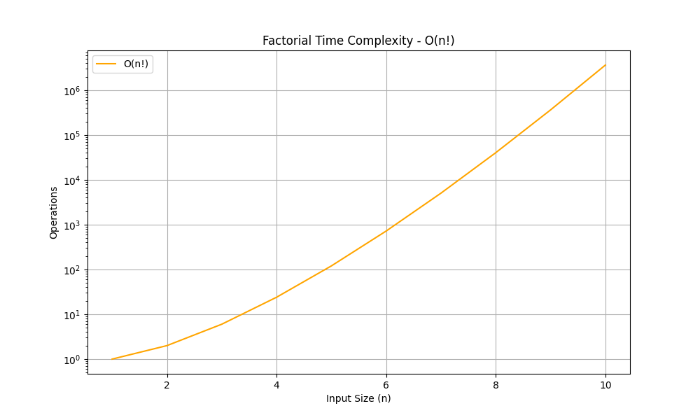

# Big O Notation

Big O notation is used to describe the performance or complexity of an algorithm. It specifically describes the worst-case scenario and helps to understand the upper limits of an algorithm.

## Common Big O Notations

| Notation   | Name              | Description                                                             | Graphical Representation         |
| ---------- | ----------------- | ----------------------------------------------------------------------- | -------------------------------- |
| O(1)       | Constant Time     | The runtime is constant and does not change with the size of the input. |            |
| O(log n)   | Logarithmic Time  | The runtime grows logarithmically with the size of the input.           |     |
| O(n)       | Linear Time       | The runtime grows linearly with the size of the input.                  |            |
| O(n log n) | Linearithmic Time | The runtime grows in proportion to n log n.                             |  |
| O(n^2)     | Quadratic Time    | The runtime grows quadratically with the size of the input.             |         |
| O(2^n)     | Exponential Time  | The runtime grows exponentially with the size of the input.             |         |
| O(n!)      | Factorial Time    | The runtime grows factorially with the size of the input.               |          |

## Visual Representation

### Constant Time - O(1)

### Logarithmic Time - O(log n)

### Linear Time - O(n)

### Linearithmic Time - O(n log n)

### Quadratic Time - O(n^2)

### Exponential Time - O(2^n)

### Factorial Time - O(n!)

## Conclusion

Understanding Big O notation is crucial for analyzing the efficiency of algorithms. It helps in making informed decisions about which algorithm to use based on the input size and the required performance.
